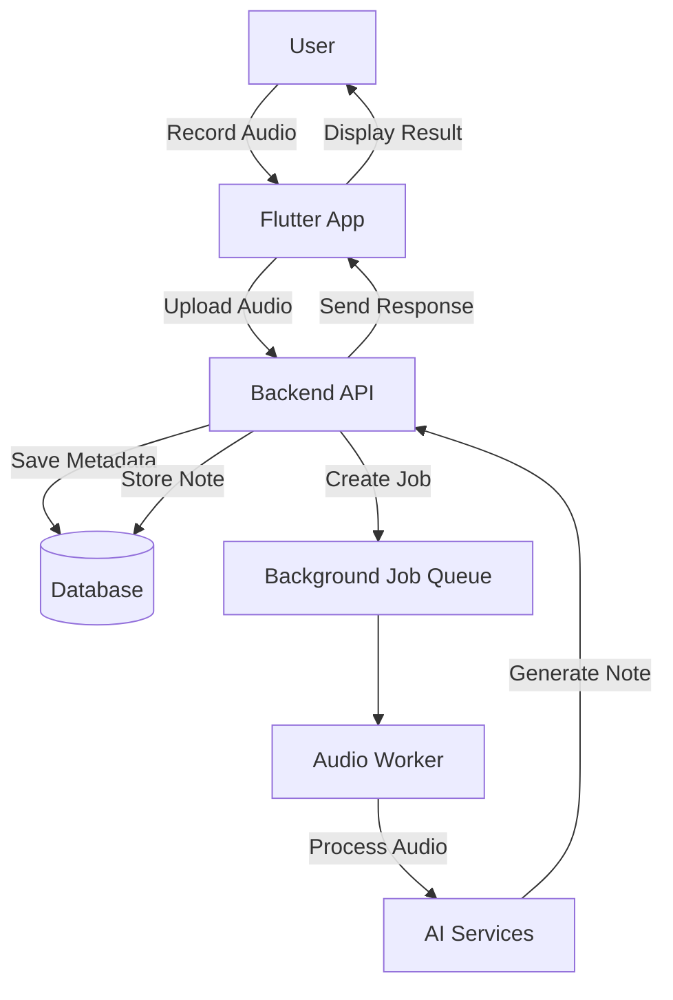

# 🎙️Voice Note & AI Assistant Platform

Voice Note là một nền tảng ghi chú bằng giọng nói và trợ lý AI toàn diện (full-stack). Hệ thống cho phép người dùng ghi âm, xử lý âm thanh bất đồng bộ, tự động tạo ghi chú và tương tác với chatbot chạy bằng AI.

---

## 📌 Tính năng nổi bật

**Voice Note** helps users:
-Ghi âm và tải lên: Thu âm trực tiếp và tải các tệp âm thanh lên hệ thống.
-Xử lý nền: Tự động xử lý âm thanh thông qua các tác vụ chạy ngầm (background jobs).
-Tự động tạo ghi chú: Chuyển đổi nội dung từ âm thanh thành văn bản ghi chú một cách tự động.
-Quản lý khoa học: Tổ chức ghi chú và tệp âm thanh vào các thư mục để dễ dàng quản lý.
-Tìm kiếm thông minh: Tìm kiếm ghi chú bằng công nghệ nhúng (embeddings), giúp tìm theo ý nghĩa thay vì chỉ từ khóa.
-Trợ lý AI (RAG): Trò chuyện với trợ lý AI dựa trên dữ liệu cá nhân (Retrieval-Augmented Generation).
-Thông báo hệ thống: Nhận thông báo cập nhật về trạng thái xử lý và các hoạt động khác.

---
## 🧩 Công nghệ sử dụng

### Frontend
- Flutter
- Clean Architecture
- BLoC (State Management)
- Dio (HTTP Client)
- GetIt (Dependency Injection)

### Backend
- Node.js
- RESTful API
- Background job processing
- Database with relational modeling
- AI & Embedding integration

---
## 📌 Luồng hoạt động hệ thống (System Workflow)

